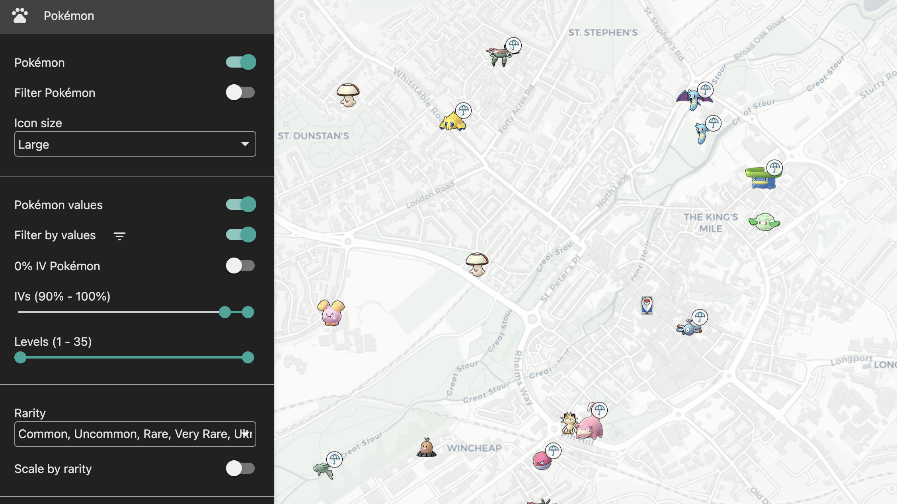
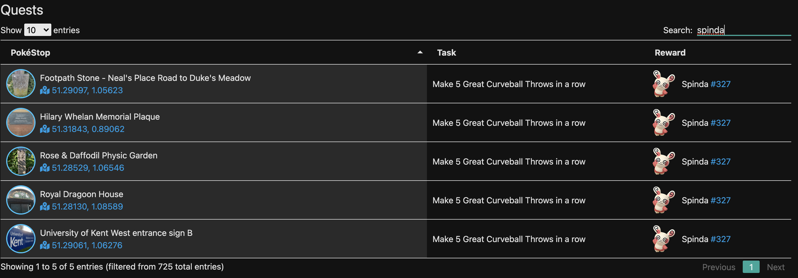
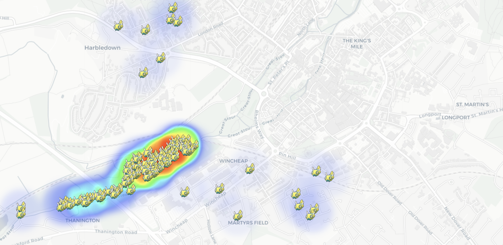
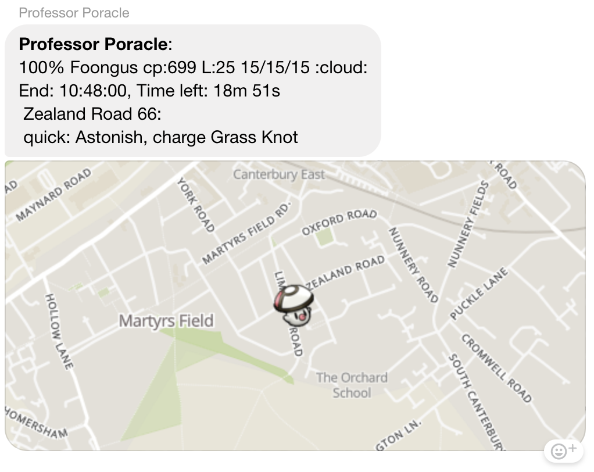
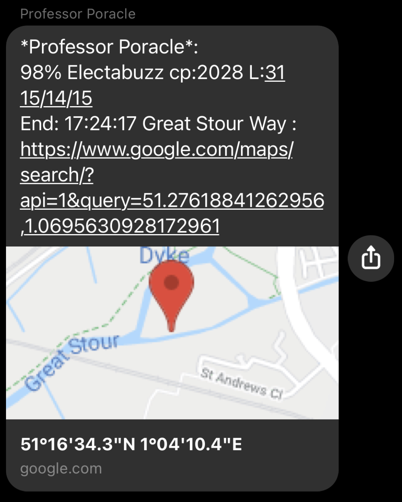

# Local community information

Resource | Description
--- | ---
The map | The canterbury pokemon map - available to https://canterburypokemon.com
Facebook Group | This facebook group is the most active
Raid group | This is an invite-only messenger group. To get invited ask in one of the public access
Remote Raid Group | This is a messenger group
UKC Raid Group | A raid group for UKC staff and students
Discord | Join here
Scanner notification channels | There are some general access notifications provided both through Facebook messenger or Discord; see below

# Neighbouring communities

We have a number of neighbouring communities

There are neight
Faversham | A facebook group
Thanet
Dover Deal

If you would like to be listed here, please join the Canterbury discord group and make yourself known

# Canterbury Map

## Coverage Area

## Controls and options

Some things to try

### Pokemon

Filter pokemon by type, or by IV. In this screen shot I'm showing pokemon filtered by IV > 90%.  Other interesting things to try are to size the pokemon icons by rarity

### Quests

Current quests

### Raids

### "Follow-me"

### Interesting

I wonder where I would go if I was looking for dunsparse...

# Notification Groups

## Facebook

On facebook there are two notification groups.  You need to ask to be invited, but there are no restrictions on membership so anyone can add you.

The two groups are:

### Hundos

This shows 100% IV Pokemon found by the map for the entire Canterbury area.  If you only want to see a small section of these notifications, see custom notifications

### Community day, High IV

A special alert channel runs on community days.  This shows Pokemon with an IV of 96%.  These notifications don't show the pokemon map tile, but rather include a link to google maps taking you straight to the pokemon.

## Discord

There are four discord channels.

`#pokestop-change-notifications`

`#mapping-quests`

`#mapping-hundos`
`#mapping-community-day`

# Custom Notifications

## Wake up poracle
Professor Poracle will talk to you by sending you direct messages in discord.  You can start the conversation by connecting to the Canterbury Pokemon Discord Server, going into the `#mapping-discussion` channel and calling for poracle with the command `!poracle`

**screen shot here**

## Simple commands

Command | Description
--- | ---
**!help** | Replies with some help text
**!tracked** | Display a summary of everthing you are currently tracking
**!stop** | Stop sending me messages - if you have tracked too much this can be a good way to stop the Professor spamming you!
**!start** | Start sending messages again
 
## Notification area

You will only receive notifications for things that happen within the areas you have opted in, _or_ within a certain distance from a specific location you set.

When you first start to use poracle, it is sensible to use the pre-defined areas

## Setting your area

You can always see a list of areas that poracle currently supports by using the command `!area list`. The current areas are:

Area name | Description
--- | ---
canterbury | The whole of the canterbury area covered by the scanner
city | The city centre area
ukc | The University of Kent campus
wincheap | The wincheap area
bridge | Bridge village

To add yourself to an area, issue a command like `!area add city`.  Removing yourself is just the reverse `!area remove city`.  You can see the areas you are interested in using the `!tracked` command

## Setting your location

You can set your home location and ask for notifications only within a certain distance of that. You do this by specifying !location -

eg `!location 10 New Dover Road, Canterbury` 
eg `!location lat,lon`

Once you have specified your location you can then add a distance marker to notifications - eg `!egg level5 d500` - to see things within 500m of your house

### Distance guide

How far/fast can you walk? Here is a guide from the internet (so it must be true!)

Metres | Fast | Moderate | Easy Walk 
---|---|---|---
 1000   |   7   |    10    |     13 
 2000   |   14  |    20    |     25 
 3000   |   21  |    30    |     38 
 4000   |   28  |    40    |     50 
 5000   |   35  |    50    |     63

# What type of things can I be notified about?

## Quests
Examples might be  `!quest spinda` or `!quest rare_candy` - note the underscore instead of spaces

## Raids
Egg pops? `!egg level5` (remove with `!egg remove level5`) - or raids `!raid heatran`

## Pokemon

Example might be `!track gible` - you can “!untrack everything” - or you might be interested in high value mons - `!track everything iv100`

Advanced use

# Contributing to local waypoints

Join the discord channel `#pokestop-and-wayfarer-chat`
There is an alert channel which shows new pokestops found by the mapping elves `#pokestop-change-notification`
Location edits can now cause problems for existing pokestops, so please join discord

# Get in touch

Join discord
