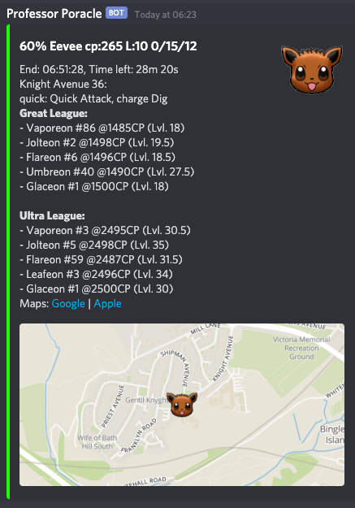

All the notifications are run by a bot called **Professor Poracle**.  The Professor is extremely diligent, but a bit fussy in the way you need to set out your requirements.

# First - _Wake up poracle_

Professor Poracle will talk to you by sending you direct messages in discord.  You can call him to start a conversation by connecting to the Canterbury Pokemon Discord Server, going into the `#mapping-discussion` channel and calling for poracle with the command `!poracle`

# Web interface

Once you have called the professor in Discord you can make changes to your notifications either by using commands - or the new web interface - [here](https://poracle.canterburypokemon.com)

# Simple commands

When you are talking to the Professor there are a few basic commands you should remember

Command | Description
--- | ---
**!help** | Replies with some help text
**!tracked** | Display a summary of everthing you are currently tracking
**!stop** | Stop sending me messages - if you have tracked too much this can be a good way to stop the Professor spamming you!
**!start** | Start sending messages again

# Notification area

You will only receive notifications for things that happen within the areas you have opted in, _or_ within a certain distance from a specific location you set.

When you first start to use poracle, it is sensible to use the pre-defined areas

# Setting an area for alerts

You can always see a list of areas that poracle currently supports by using the command `!area list`. The current areas are:

Area name | Description
--- | ---
canterbury | The whole of the canterbury area covered by the scanner
city | The city centre area (red)
ukc | The University of Kent campus (north blue)
wincheap | The wincheap area (west blue)
stdunstans | The St Dunstans area (orange)
bridge | Bridge village

To add yourself to an area, issue a command like `!area add city`.  Removing yourself is just the reverse `!area remove city`.  You can see the areas you are interested in using the `!tracked` command

# Setting your location

You can set your home location and ask for notifications only within a certain distance of that. You do this by specifying !location -

eg `!location 10 New Dover Road, Canterbury` 

or find the latitude and longitude of your address in google maps and set it directly

eg `!location 51.279,1.080`

Once you have specified your location you can then add a distance marker to notifications by using the `d` flag - for example `!egg level5 d500` - to see things within 500m of your house

### Distance guide

How far/fast can you walk? Here is a guide from the internet (so it must be true!)

Metres | Fast | Moderate | Easy Walk 
---|---|---|---
 1000   |   7   |    10    |     13 
 2000   |   14  |    20    |     25 
 3000   |   21  |    30    |     38 
 4000   |   28  |    40    |     50 
 5000   |   35  |    50    |     63

# What type of things can I be notified about?

## Quests
Examples might be  `!quest spinda` or `!quest rare_candy` - note the underscore instead of spaces

To remove quests - `!quest remove everything` (or name of specific quest)

## Raids
Egg pops? `!egg level5` (remove with `!egg remove level5`) - or raids `!raid heatran`

To remove eggs - `!egg remove`

To remove raids - `!raid remove everything`

## Pokemon

Example might be `!track gible` - you can “!untrack everything” - or you might be interested in high value mons - `!track everything iv100`

To untrack pokemon use the !untrack command eg `!untrack everything`

You can qualify the pokemon you are tracking with some filters

| Filter    | Example                         | Description  |
| --------- |:-------------------------------:| -----------:|
|           |`!track pikachu`                 | No filters, tracks pikachu within an area you are tracking in |
|d          |`!track pikachu d750`            | Tracks pikachu within 750 meters of your !location |
|iv         |`!track pikachu iv90`            | Tracks pikachu inside a tracked area with a minimum IV of 90%  |
|maxiv      |`!track pikachu maxiv0`          | Tracks pikachu with 0% IV   |
|weight     |`!track magikarp weight13130`    | Tracks "big" magikarp (13130 grams and higher)|
|maxweight  |`!track rattata maxweight2410`   | Tracks "tiny" rattata (2410 grams and lower)|
|male       |`!track rattata male`            | Tracks male rattata |
|female     |`!track pikachu female`          | Tracks female pikachu |
|everything |`!track everything iv90 level20` | Tracks eveything with a minimum IV of 90% level 20 and higher. |
|gen |`!track everything gen6 iv60 level15` | Tracks gen 6 pokemon with a minimum IV of 60% level 15 and higher. |

## PVP Tracking!

New!

|Command|Usage|
|---|---|
|`!track snorlax great1`| for top 1 great league snorlax|
|`!track everything great1 greatcp1450`| for top 1 great league pokemon| maxing out at or above 1450CP|
|`!track snorlax ultra100`| for top 100 ultra league snorlax|
|`!track everything ultra1 ultracp2400`| for top 1 great league pokemon maxing out at or above 2400CP|

An example notification containing PVP information - you can see what this Eevee can become in Great and Ultra leagues in all its various forms

# Help! I can't get it working!
(or it's spamming me!)

Look closely at your `!tracked` -- if you are using `d` after any of the things you are tracking then that is the distance from the location.  Anything without a `d` will be sent to you only if it is in one of the areas listed

Issue `!stop` if you are being spammed. 

Just ask in the `#mapping-discussion` channel - someone will help you out.
