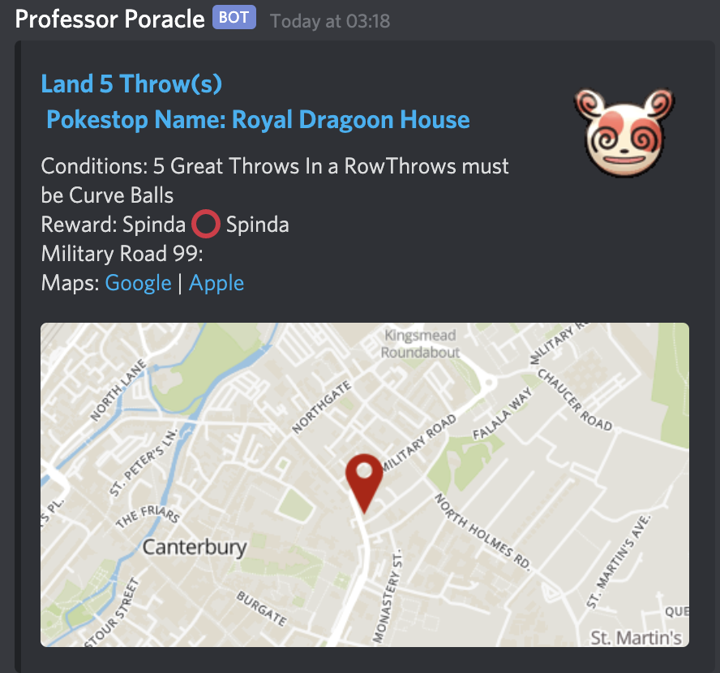

# Custom Notifications

## Wake up poracle
Professor Poracle will talk to you by sending you direct messages in discord.  You can start the conversation by connecting to the Canterbury Pokemon Discord Server, going into the `#mapping-discussion` channel and calling for poracle with the command `!poracle`

**screen shot here**

## Simple commands

Command | Description
--- | ---
**!help** | Replies with some help text
**!tracked** | Display a summary of everthing you are currently tracking
**!stop** | Stop sending me messages - if you have tracked too much this can be a good way to stop the Professor spamming you!
**!start** | Start sending messages again
 
## Notification area

You will only receive notifications for things that happen within the areas you have opted in, _or_ within a certain distance from a specific location you set.

When you first start to use poracle, it is sensible to use the pre-defined areas

## Setting your area

You can always see a list of areas that poracle currently supports by using the command `!area list`. The current areas are:

Area name | Description
--- | ---
canterbury | The whole of the canterbury area covered by the scanner
city | The city centre area
ukc | The University of Kent campus
wincheap | The wincheap area
bridge | Bridge village

To add yourself to an area, issue a command like `!area add city`.  Removing yourself is just the reverse `!area remove city`.  You can see the areas you are interested in using the `!tracked` command

## Setting your location

You can set your home location and ask for notifications only within a certain distance of that. You do this by specifying !location -

eg `!location 10 New Dover Road, Canterbury` 
eg `!location lat,lon`

Once you have specified your location you can then add a distance marker to notifications - eg `!egg level5 d500` - to see things within 500m of your house

### Distance guide

How far/fast can you walk? Here is a guide from the internet (so it must be true!)

Metres | Fast | Moderate | Easy Walk 
---|---|---|---
 1000   |   7   |    10    |     13 
 2000   |   14  |    20    |     25 
 3000   |   21  |    30    |     38 
 4000   |   28  |    40    |     50 
 5000   |   35  |    50    |     63

# What type of things can I be notified about?

## Quests
Examples might be  `!quest spinda` or `!quest rare_candy` - note the underscore instead of spaces

## Raids
Egg pops? `!egg level5` (remove with `!egg remove level5`) - or raids `!raid heatran`

## Pokemon

Example might be `!track gible` - you can “!untrack everything” - or you might be interested in high value mons - `!track everything iv100`

Advanced use
