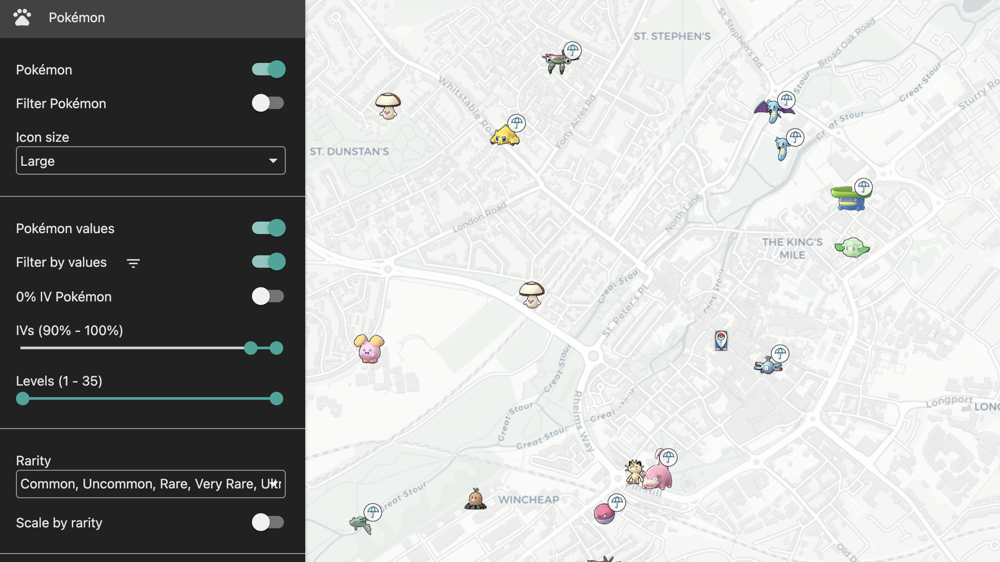
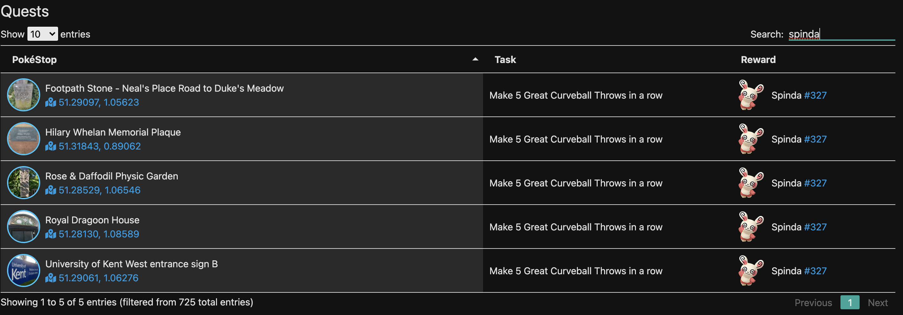
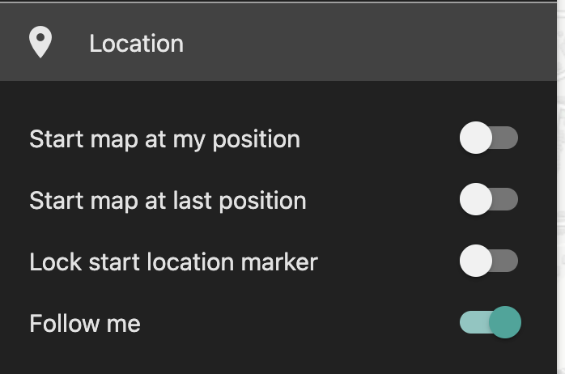
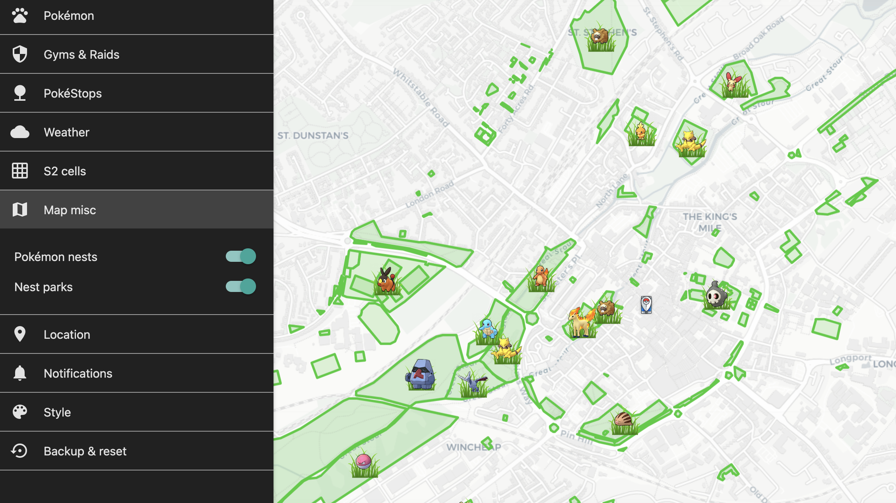
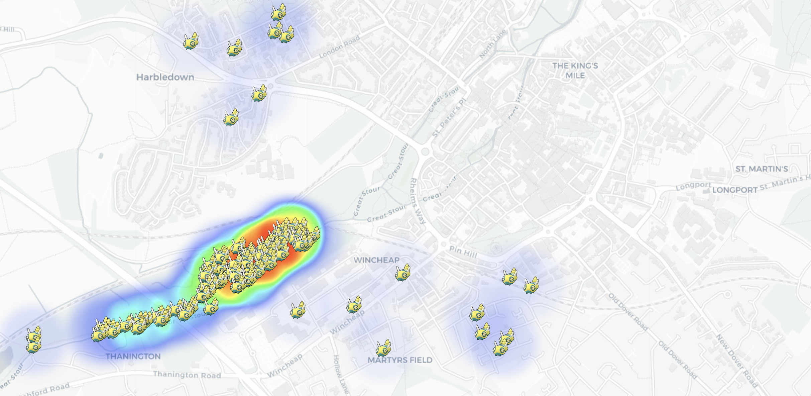

The Canterbury Pokemon map is run by a small army of elves who walk around Canterbury checking everything out so you don't have to.  They update the map and also provide the source of data used by the notification systems.

# Controls and options

The map is accessed by going to [canterburypokemon.com](https://canterburypokemon.com)
When you first see the map it can look a bit confusing as all the settings start at on - the best thing to do is to go into each category and turn them off and then build back up to the information that you are interested in.

## Pokemon

Filter pokemon by type, or by IV. In this screen shot I'm showing pokemon filtered by IV > 90%.  Other interesting things to try are to size the pokemon icons by rarity

## Pokestop and quests

Show all pokestops, and their current quest, rocket invasion, and lure status. 

The display for quests is when you are holding an 'AR Quest' (Scan a pokestop). The game will give you a different quest if you don't have one of these but we can't display this on the map just yet.

You can filter to show particular quest, lure or invasion types.  This example is showing pokestops filtered to Spinda and Mega Energy, as well as lures. 

### Quest list

There is also a quest list accessible by clicking on the compass in the top right hand corner. This allows you to search for quests you are interested in.

## Gyms and Raids

Gyms can be displayed along with their current owner as well as eggs and current raid bosses. All can be filtered.

This example shows current raids at all levels, but this can be restricted to legendary raids, for example.

## Other interesting features

### "Follow-me"

The location settings allow you to set "follow-me". Especially useful when using mobile device and searching for specific or high IV pokemon.

a

b

### Nest display

### Historic Pokemon View

The pawprint icon in the top right will take you to a list of Pokemon that have been seen by the elves tabulated by frequency.  You can change the time period, and active a heatmap.

I wonder where I would go if I was looking for dunsparse...

# Coverage Area

To be completed

# Adding new areas

If you are in the Canterbury area and would like to see your area covered please get in touch - the map is very much demand led