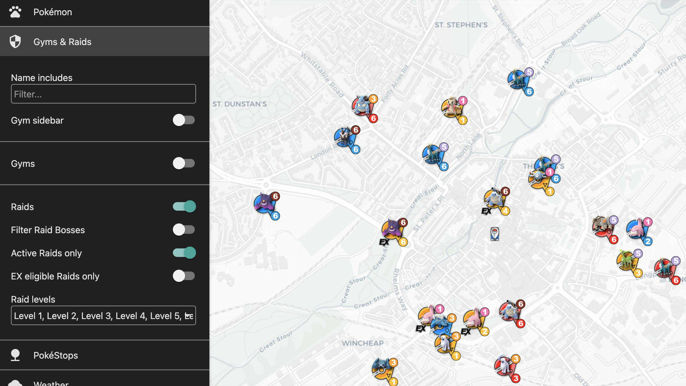

# Canterbury Map

## Coverage Area

## Controls and options

Some things to try

### Pokemon

Filter pokemon by type, or by IV. In this screen shot I'm showing pokemon filtered by IV > 90%.  Other interesting things to try are to size the pokemon icons by rarity

### Quests

Current quests

### Raids

### "Follow-me"

### Interesting

I wonder where I would go if I was looking for dunsparse...
