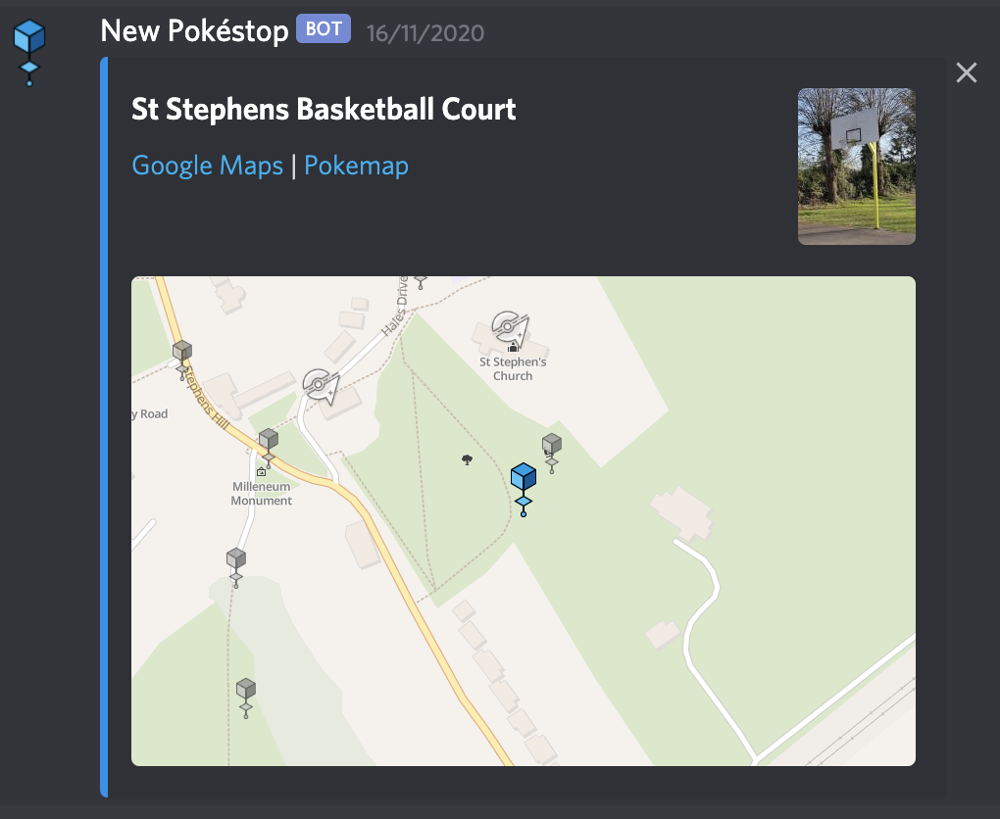

# Notification Groups

## Facebook

On facebook there are two notification groups.  You need to ask to be invited, but there are no restrictions on membership so anyone can add you.

The two groups are:

### Hundos

This shows 100% IV Pokemon found by the map for the entire Canterbury area.  If you only want to see a small section of these notifications, see custom notifications

### Community day, High IV

A special alert channel runs on community days.  This shows Pokemon with an IV of 96%.  These notifications don't show the pokemon map tile, but rather include a link to google maps taking you straight to the pokemon.

## Discord

There are four discord channels.

`#pokestop-change-notifications`

`#mapping-quests`

`#mapping-hundos`
`#mapping-community-day`
